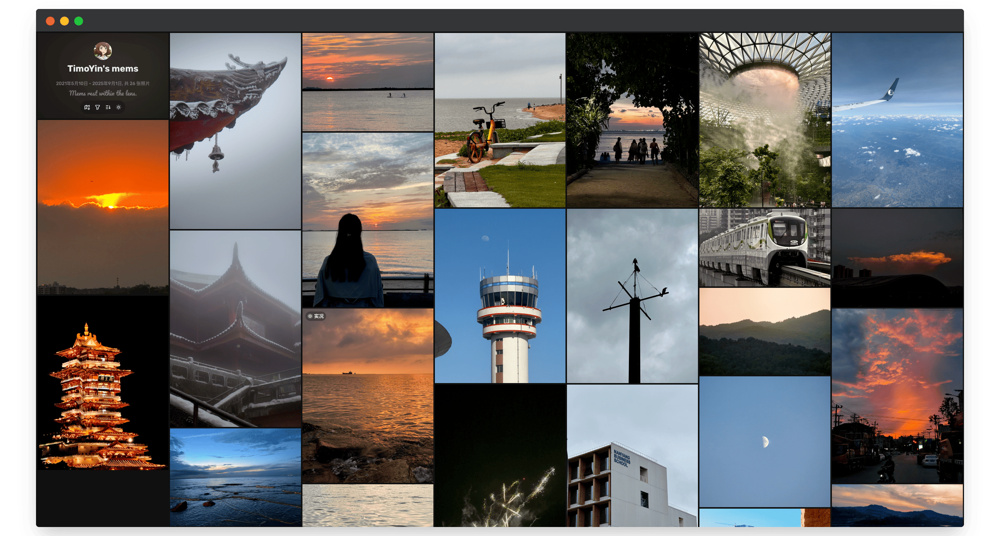
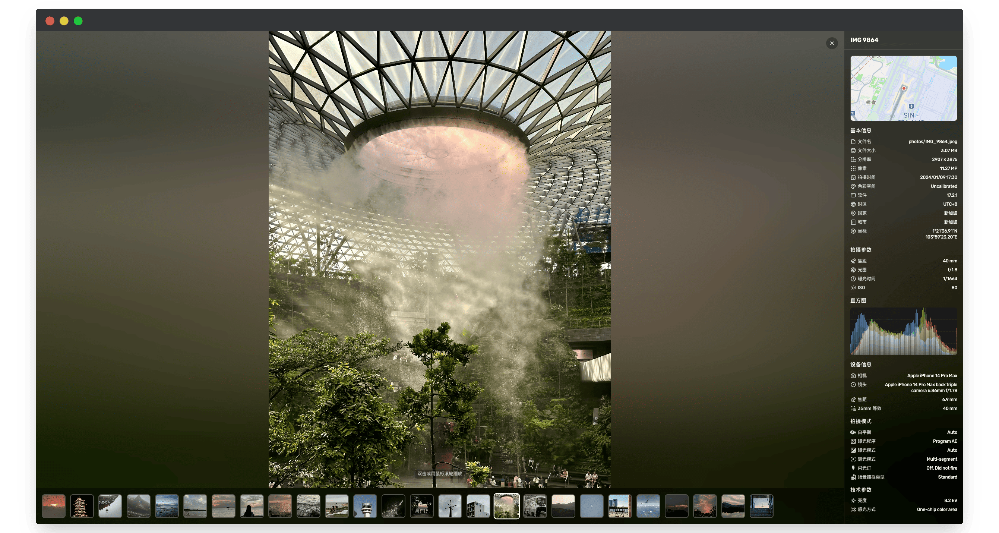
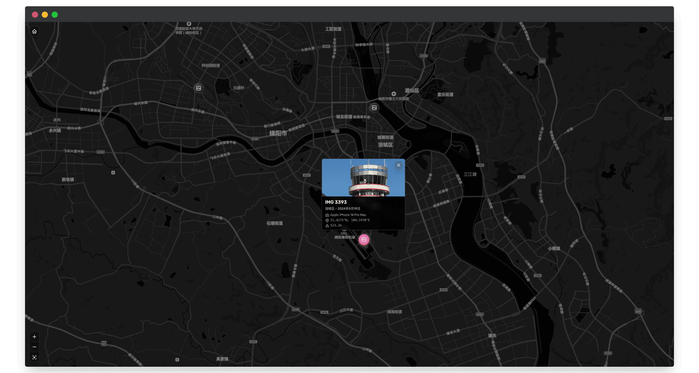
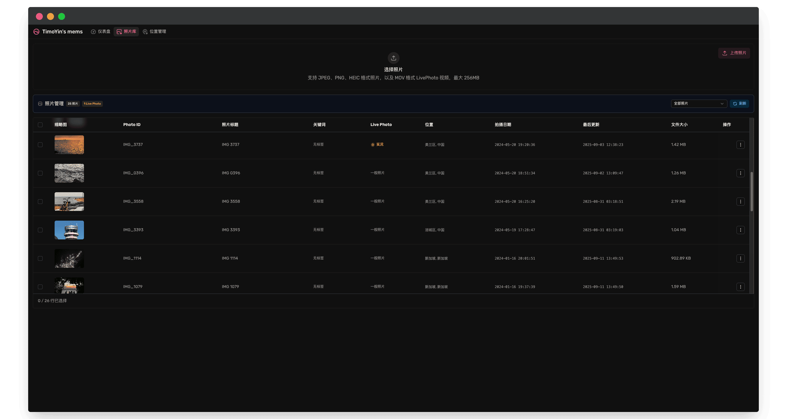

# ChronoFrame

<p align="center">
  
</p>

<p align="center">
  <a href="https://github.com/HoshinoSuzumi/chronoframe/releases/latest">
    
  </a>
  <a href="https://github.com/HoshinoSuzumi/chronoframe/releases">
    
  </a>
  
</p>

<p align="center">
  <a href="https://discord.gg/MM4ZK4Ed7s">
    
  </a>
</p>

<p align="center">
  <a href="https://hellogithub.com/repository/HoshinoSuzumi/chronoframe" target="_blank"></a>
  <a href="https://www.producthunt.com/products/chronoframe?embed=true&utm_source=badge-featured&utm_medium=badge&utm_source=badge-chronoframe" target="_blank"></a>
</p>

**Languages:** English | [中文](README_zh.md)

ChronoFrame is a self-hosted photo gallery. Upload your photos and it extracts EXIF, creates previews and identifies shooting locations. Visitors can browse by time, album or map, zoom into large images and play Live Photos.

[Live demo](https://lens.bh8.ga) · [Documentation](https://chronoframe.bh8.ga/) · [Changelog](https://chronoframe.bh8.ga/changelog)

## ✨ Features

- **Photo browsing**: masonry layout, filters and sorting, WebGL zoom and tiled rendering, histograms, original downloads and share previews.
- **Live and Motion Photos**: automatic image/video pairing, with hover or long-press playback.
- **Albums**: organize and reorder albums and photos, hide albums or protect them with passwords.
- **Dashboard**: batch uploads, metadata and rating editing, batch downloads and reindexing; task queues, live logs and recent activity.
- **Storage**: local files, S3-compatible services and OpenList, with storage schemes and CDN URLs managed in the dashboard.
- **Maps and locations**: MapLibre / Mapbox maps, reverse geocoding and a choice of place-name language.
- **Setup wizard**: create an administrator and configure your site and storage in the browser. Manage everyday settings in the dashboard.
- **Languages and login**: dashboard language switching, email/password login and optional GitHub OAuth, custom analytics scripts and upload privacy settings.

## 🐳 Deployment

Docker is the recommended option. Create `docker-compose.yml`:

```yaml
services:
  chronoframe:
    image: ghcr.io/hoshinosuzumi/chronoframe:latest
    container_name: chronoframe
    restart: unless-stopped
    ports:
      - '3000:3000'
    volumes:
      - ./data:/app/data
```

```bash
docker compose up -d
```

You can also use `hoshinosuzumi/chronoframe:latest` from Docker Hub. Replace the tag with `v1.0.0` to pin the version.

To run directly with Docker:

```bash
docker run -d --name chronoframe --restart unless-stopped \
  -p 3000:3000 -v "$(pwd)/data:/app/data" \
  ghcr.io/hoshinosuzumi/chronoframe:latest
```

Open `http://localhost:3000` and use the setup wizard to create your administrator and choose storage. For local storage, enter `/app/data/storage`. You can add a map token later and start uploading photos first.

Keep the `./data` mount: it holds the database, settings, session secret and local photos when using the path above.

Use HTTPS for a public deployment. See [Getting Started](https://chronoframe.bh8.ga/guide/getting-started) and the [update guide](https://chronoframe.bh8.ga/guide/updates) for proxies, backups and migration from older versions.

## 📖 Usage

Sign in and open `/dashboard` to upload and organize photos. After upload, the task queue processes EXIF, thumbnails, locations and Live Photos. Failed tasks show an error and can be retried.

For Apple Live Photos, the image and MOV must share a filename, such as `IMG_1234.heic` and `IMG_1234.mov`; either can be uploaded first. Image formats include JPEG, PNG, WebP, GIF, BMP, TIFF and HEIC / HEIF.

Album passwords control access through ChronoFrame. If S3, OpenList or a CDN exposes public image URLs, manage access in that service too. Read [Using ChronoFrame](https://chronoframe.bh8.ga/guide/usage) for details.

## 📸 Screenshots






## 🛠️ Development

Use Node.js 22 and the project's pinned pnpm 10.34.1:

```bash
corepack enable
pnpm install --frozen-lockfile
pnpm dev
```

Open `http://localhost:3000` and complete local setup in the wizard. Use `./data/storage` for local development storage.

```bash
pnpm lint          # Oxlint
pnpm fmt:check     # Oxfmt
pnpm build:deps    # Build the WebGL package
pnpm build         # Build the application
pnpm docs:build    # Build documentation
```

After changing the database schema, run `pnpm db:generate` and review the SQL. Generating migrations is unnecessary just to start the app. See the [contributing guide](https://chronoframe.bh8.ga/development/contributing) for more.

## 🤝 Contributing and community

Issues and pull requests are welcome. Explain the problem, resulting behavior and verification. Keep English and Chinese documentation in sync.

[GitHub Issues](https://github.com/HoshinoSuzumi/chronoframe/issues/new/choose) · [Discussions](https://github.com/HoshinoSuzumi/chronoframe/discussions) · [Discord](https://discord.gg/MM4ZK4Ed7s)

## 🙏 Acknowledgements

Thanks to the maintainers of [Nuxt](https://nuxt.com/), [Vue](https://vuejs.org/), [Tailwind CSS](https://tailwindcss.com/), [Drizzle ORM](https://orm.drizzle.team/) and other open-source dependencies, and everyone contributing testing, translations and code.

## ⭐️ Star History

<a href="https://star-history.dera.page/#HoshinoSuzumi/chronoframe&type=date&legend=top-left">
 <picture>
   <source media="(prefers-color-scheme: dark)" srcset="https://star-history.dera.page/svg?repos=HoshinoSuzumi/chronoframe&type=date&theme=dark&legend=top-left" />
   <source media="(prefers-color-scheme: light)" srcset="https://star-history.dera.page/svg?repos=HoshinoSuzumi/chronoframe&type=date&legend=top-left" />
   
 </picture>
</a>
